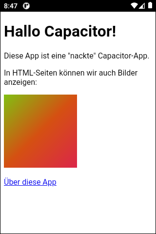
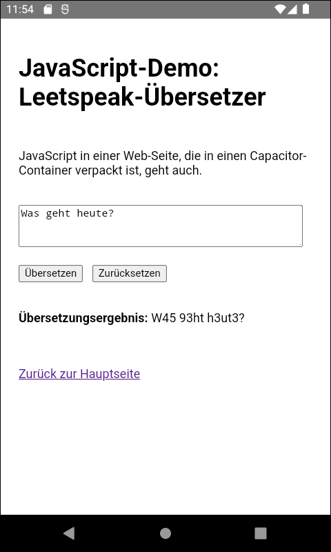

# Capacitor-App "pur" #

 

Pure [Capacitor](https://capacitorjs.com/)-App, enthält nur "normalen" Web-Content (siehe Ordner [www/](www))
ohne Framework wie Ionic.

 

----

## Screenshots ##

 

  &nbsp;  

 

----

## License ##

 

See the [LICENSE file](LICENSE.md) for license rights and limitations (BSD 3-Clause License) for the files in this repository.

 
